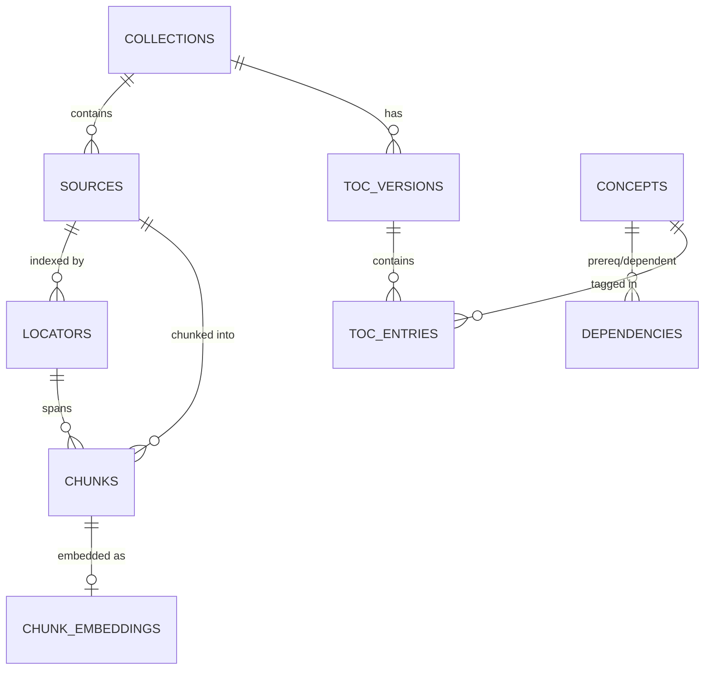
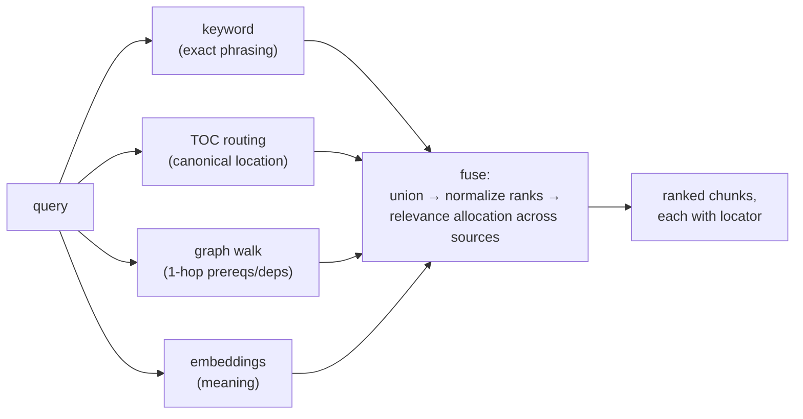
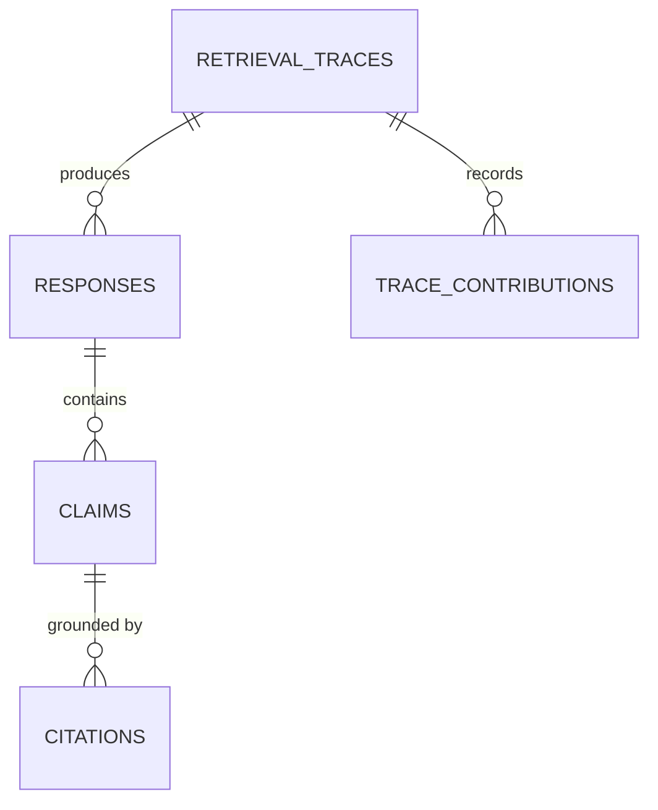

# Architecture: Emory STEM Advisor

> Retrieval-first design doc. The goal of this system is **accuracy**: every
> answer must be grounded in the internal docs, and we must be able to show
> *why* each claim is believed. Adapted from the three-layer retrieval idea
> (TOC index + knowledge graph + embeddings) proven in our prior system design.

## Core principle

Retrieval is **multi-seam and measured, not assumed**. No single retrieval
method is trusted alone. Each seam answers a different question about the
query, candidates are fused, and every surviving chunk carries a locator back
to its source. A citation contract holds the whole harness accountable: a
chunk that can't be traced to a source location never reaches the model.

**Invariants** (hold in every configuration, enforced by tests):

1. Every chunk handed to the generative model has at least one locator and
   one retrieval-trace entry naming the seam(s) that produced it.
2. Vectors of different dimensionality or different `model` values are never
   scored against each other.
3. Seam quotas, fusion parameters, and model routing live in versioned
   config; nothing retrieval-critical is hardcoded.
4. A query with zero grounded candidates is a refusal, never an ungrounded
   answer.
5. Every upgrade ships with an eval delta against the frozen eval set; a
   regression blocks merge.

## Data model

The retrieval substrate is shared by all seams. Postgres is the store;
schemas are shown as logical entities.



**`sources`** — the ingested document. Stored whole; nothing destroyed at
ingest. `file_hash` dedups re-uploads. `status` ∈ {`uploaded`, `parsed`,
`chunked`, `indexed`, `failed`} with `error_message` on failure.

**`locators`** — the per-format table of contents of one source.
`(locator_id, source_id, locator_type, start, end, label)`.
`locator_type` is a free string (`page`, `slide`, `section`, `timestamp`,
`line_range`, `cell_range`, ...) so new formats insert without schema change.
Citations render `label` ("slide 7", "page 3").

**`chunks`** — the retrieval unit. Token-bounded, not line-bounded:

```sql
CREATE TABLE chunks (
    chunk_id      uuid PRIMARY KEY,
    source_id     uuid NOT NULL REFERENCES sources,
    locator_id    uuid NOT NULL REFERENCES locators,
    chunk_index   int  NOT NULL,          -- position within source
    token_count   int  NOT NULL,
    text          text NOT NULL
);
```

Chunking rules:

- `target_tokens` and `overlap_tokens` from config (default 512 / 64).
- Boundaries fall on structure where the format provides it (section breaks,
  page edges); otherwise on sentence end nearest the token budget.
- A chunk that spans multiple locators records the locator it *starts* in;
  the citation renders the span from `chunks.locator_id` through the last
  locator its text reaches, computed at citation-render time.
- Chunk text is stored with a stable normalized form (BOM stripped, Unicode
  NFC, cp1252 fallback at extraction) so re-ingestion of identical bytes
  produces identical chunks and dedups downstream work.

**`chunk_embeddings`** — one row per chunk per model:

```sql
CREATE TABLE chunk_embeddings (
    chunk_id   uuid PRIMARY KEY REFERENCES chunks,
    model      text   NOT NULL,           -- part of the key
    embedding  float8[] NOT NULL,         -- L2-normalized at write time
    created_at timestamptz NOT NULL DEFAULT now(),
    PRIMARY KEY (chunk_id, model)
);
CREATE INDEX ON chunk_embeddings (model);
```

Vectors are **L2-normalized at write time** (`|v| = 1`), which makes dot
product equal to cosine similarity at query time — see §3.

**`toc_versions` / `toc_entries`** — the model-written index.
`toc_entries(entry_id, toc_id, source_id, locator_id, title, description,
concepts jsonb, position)`. `concepts` is a list of concept names (free
strings until the graph layer lands and canonicalizes them). Exactly one
TOC version per collection is current; versions are append-only.

**`concepts` / `dependencies`** — the knowledge graph.
`dependencies(dep_id, prereq_id NULL, dependent_id, prereq_kind
∈ {in_collection, external}, external_ref NULL, evidence_level ∈ {direct,
derived, hypothesis})`. `prereq_id` NULL + `external_ref` set = dependency
on something outside the collection.

**`retrieval_traces`** — the audit record (§5).

## The three retrieval layers

### 1. TOC — the index layer ("where is this *taught*?")

A model-written, per-collection, versioned **table of contents** describing
what each document contains and where.

**Construction.** After ingest writes chunks, the TOC-writer model (small,
stable — its frozen vocabulary is what makes matching reliable) receives the
collection's locator list with short text windows and emits entries. Output
is validated against a schema before write; invalid entries drop the stage,
never half-write a TOC. The TOC is versioned: a re-ingest that adds sources
produces `version n+1`, derived from `version n` (a *cascading* update —
existing entries are re-asserted, not rewritten from scratch).

**Query-time matching (static, v1).**

1. Normalize the query (lowercase, strip punctuation, snowball stem).
2. Score each entry: exact title match > title token overlap > description
   token overlap. Config weights, e.g. `title_exact=1.0`, `title_token=0.6`,
   `description_token=0.3`.
3. Keep entries above threshold `toc_match_min`; emit each entry's locator →
   the chunks under it, rank = match score.

**Upgrade path (model-routed, v2 — measured only).** Route the query +
candidate entry titles through the generative model to pick entries. Costs a
model call per query; ships only if it beats static matching on the eval set
by a documented margin.

### 2. Graph — the structure layer ("what does this *depend on*?")

Concepts and dependencies extracted from the docs, each with an evidence
level. The seam answers: *the query matched concept X; the answer probably
also needs X's prerequisites and things that build on X.*

**Query-time expansion (1 hop, direction-aware):**

```text
matched_concepts = concepts matching query (via TOC entry tags or keyword)
for c in matched_concepts:
    if config.walk_direction in {upstream, both}:
        emit chunks evidenced for prereqs(c)         -- "what you need first"
    if config.walk_direction in {downstream, both}:
        emit chunks evidenced for dependents(c)      -- "what this unlocks"
```

Each emitted chunk's rank = the matched concept's match score ×
`graph_decay` (config, default 0.8) — one hop of discount, so expansion
candidates never outrank direct matches.

**Dormancy rule.** Only edges with `evidence_level = 'direct'` participate
initially. `derived`/`hypothesis` edges are stored but inert. Promotion is a
deliberate config change after manual review — a wrong edge misdirects
silently, so the seam stays off until the edges are trustworthy. A seam with
no data contributes nothing and breaks nothing.

### 3. Embeddings — the meaning layer ("where is this *implied*?")

The math, end to end. An embedding model maps text to a vector
**v** ∈ ℝᵈ (d = model-dependent, e.g. 768–3072). Training squeezes semantic
similarity into geometry: texts about the same thing land at a small angle
apart, regardless of shared vocabulary.

**Cosine similarity** measures that angle, ignoring magnitude:

```
cos(q, c) = (q · c) / (‖q‖ · ‖c‖)      range [-1, 1]
```

Magnitude mostly encodes "how much was said," not "what it's about," so
cosine discards it. At write time we store **L2-normalized** vectors
(‖v‖ = 1), so at query time `cos(q, c) = q · c` — a plain dot product,
computable natively in SQL.

**Ingestion-time embedding.** After chunks are written, each chunk's text is
embedded and stored with the model name. Re-embedding under a new model
writes new rows keyed by the new name alongside the old; the query-time
model filter is what makes a swap safe without a mass rewrite. Chunks
without a row for the current model simply don't participate — absence is
dormancy, not error.

**Query-time seam.** Embed the query at answer time (one call), then:

```sql
-- top-N chunks for the current model; dimension guard excludes mismatches
SELECT c.chunk_id, SUM(q.val * e.val) AS dot
FROM chunk_embeddings e
CROSS JOIN LATERAL unnest(e.embedding) WITH ORDINALITY AS e(val, i)
JOIN      LATERAL unnest(:query_vec)  WITH ORDINALITY AS q(val, i) USING (i)
JOIN chunks c ON c.chunk_id = e.chunk_id
WHERE e.model = :current_model
  AND cardinality(e.embedding) = cardinality(:query_vec)
  AND c.source_id = ANY(:collection_sources)
GROUP BY c.chunk_id, c.chunk_index
ORDER BY dot DESC, c.chunk_index, c.chunk_id
LIMIT :embedding_limit;
```

- **Dimension guard**: `cardinality()` equality — a mismatched-dimension row
  is excluded, never silently truncated into a garbage score.
- **Stable ordering**: `dot DESC, chunk_index, chunk_id` — same query, same
  order, every run. Determinism matters for eval reproducibility.
- **Direction**: dots are "higher = closer"; fusion keeps this sign while
  flipping rank-based seams (§4).

**Quota semantics.** `embedding_only_quota` (config) bounds chunks found
*only* by embeddings when at least one grounded seam (keyword/TOC/graph)
also matched — semantic expansion must not displace grounded hits. When no
grounded seam matched anything, the quota does not apply: embeddings are the
only evidence there is, and invariant 4 still holds because these chunks
carry locators and a trace like any other.

**The kill switch.** If the funnel without embeddings matches or beats the
funnel with them (recall@k, §6), the seam turns off via config — not code
deletion.

### Baseline seam: keyword

Full-text OR-match over chunk text (Postgres `tsvector` / equivalent).
Catches exact phrasing and scattered mentions with zero model dependency.
Ships day one; it is the baseline every other seam must beat. Rank = ts_rank
or token-coverage fraction; either way it normalizes through the same §4
pipeline.

## Fusion



### Step 1 — Candidate union

Each active seam emits `(chunk_id, rank, score, seam)` tuples. A chunk found
by multiple seams keeps every provenance record — multiplicity is signal
(used by allocation and stored in the trace) but does not multiply its
score.

### Step 2 — Seam-local normalization

Raw units are incomparable (dots vs. match scores vs. ranks), so each seam's
list normalizes independently to [0, 1]:

```
normalized(i) = 1 - (rank_i - 1) / max(1, count - 1)    -- rank seams, best = 1.0
normalized    = (dot - min) / (max - min)               -- score seams (embeddings)
```

Rank seams flip to "higher = better" here, matching embeddings, so all seams
compete in one currency. Min-max on embedding dots is computed per query over
that query's candidate set.

### Step 3 — Relevance allocation across sources

Naive top-k can cite four chunks from one doc while ignoring a more
authoritative source entirely. Allocation instead budgets the final cited
set (size `cited_set_size`, config) across sources:

1. For each source, take its best-scoring candidate as its relevance weight.
2. Split `cited_set_size` proportionally to weights, with **largest
   remainder** rounding to integers.
3. Enforce a **one-slot floor**: every source with any candidate gets ≥ 1
   slot (clamped so floors don't exceed the budget — floors are granted in
   relevance order if they do).
4. **Availability clamp**: a source's slots reduce to its actual candidate
   count; freed slots redistribute by remainder, then to the global best
   remaining candidates.
5. Within each source's budget, take that source's top candidates by fused
   score.

The result: diverse sourcing proportional to relevance, deterministic, and
explainable ("source A earned 3 of 8 slots as best-match; source B earned 1
as floor").

### Step 4 — Contract check

Every emitted chunk must have a locator and ≥ 1 seam provenance. Any
violation is a pipeline bug, not a data condition — it aborts the query and
is logged.

Seams activate as their data arrives: keyword from day one, TOC after first
ingest, graph when extracted edges are trustworthy, embeddings when the
provider pick lands.

## The harness around the layers

### Provider seam

Every model call — generative answer, TOC writing, graph extraction,
embeddings — goes through one function: `(task, prompt) -> text`, with task
∈ {`answer`, `toc_update`, `knowledge_extraction`, `embed`}. Provider,
model name, base URL, and key are config. Swapping OpenAI ↔ open-weight ↔
local never touches retrieval or answer code; no SDK objects leak past the
module. Model outputs at structured stages (TOC, extraction) are validated
against Pydantic schemas at the seam boundary — malformed output fails the
stage closed, never half-parsed.

### Evidence chain



- **`retrieval_traces`** — `(trace_id, query, collection_id, created_at)`.
- **`trace_contributions`** — `(trace_id, chunk_id, seam, normalized_score,
  source_slot)` — the audit record of *why* each chunk was retrieved.
- **`responses`** — the answer, linked to its trace and model.
- **`claims` / `citations`** — the answer decomposed into checkable claims,
  each linked to the chunk(s) grounding it. `target_type` is a free string
  (`chunk`, `toc_entry`, `concept`, ...).

The trace is what makes "why did it say that" answerable after the fact —
an auditor replays `trace_contributions` and sees exactly which seam
surfaced each cited chunk and how it was scored.

### Config, not code

`configs/retrieval.toml` (versioned, illustrative):

```toml
[chunking]
target_tokens = 512
overlap_tokens = 64

[seams]
keyword  = { enabled = true }
toc      = { enabled = true, title_exact = 1.0, title_token = 0.6, description_token = 0.3, match_min = 0.3 }
graph    = { enabled = false, decay = 0.8, directions = ["upstream"] }
embed    = { enabled = false, limit = 40, only_quota = 8 }

[fusion]
cited_set_size = 8
```

`seams.graph.enabled` flips to `true` when edges pass review; `seams.embed`
when the provider lands. The kill switch is `enabled = false`, and the
config diff is the decision record.

### Never answer without sources

A grounded question with zero surviving candidates returns a refusal ("no
relevant material found") — invariant 4. The generative model is never
prompted without a context block.

## Measurement

Accuracy is the product; the eval set is the contract.

**Eval set.** 30–50 real questions in user voice, each with manually
verified supporting passages, frozen under version control in `data/eval/`.
Adding questions is fine; editing existing ones invalidates prior deltas and
requires re-baselining.

**Metrics.**

```
recall@k      = |relevant retrieved ∩ top-k| / |relevant retrieved|
citation precision = |claims with a verified-correct citation| / |claims with citations|
```

Measured per seam AND fused. **Source preference** is scored manually: did
the cited set prefer the authoritative doc when it should have?

**Decision rules.**

- Fusion must beat the best single seam, or be simplified.
- Each seam must beat the funnel-without-it, or be turned off.
- Every upgrade lands with an eval delta against the previous config on the
  frozen set; a regression blocks merge.

## Build order

1. Keyword baseline + locators + token-bounded chunks + citation contract.
2. TOC layer (small stable model writes the index; static matching).
3. Fusion of keyword + TOC with normalization + allocation, measured on the
   eval set.
4. Graph extraction (concepts + dependencies with evidence levels) → graph
   seam (dormant → enabled on review).
5. Embeddings seam, gated on provider pick + measured help.
6. Upgrades (model-routed TOC, reranker) only on documented baseline
   failure.
