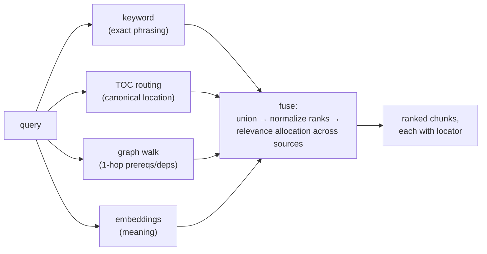

# Architecture: Emory STEM Advisor

> Retrieval-first design doc. The goal of this system is **accuracy**: every
> answer must be grounded in the internal docs, and we must be able to show
> *why* each claim is believed. Adapted from the three-layer retrieval idea
> (TOC index + knowledge graph + embeddings) proven in our prior system design.

## Core principle

Retrieval is **multi-seam and measured, not assumed**. No single retrieval
method is trusted alone. Each seam answers a different question about the
query, candidates are fused, and every surviving chunk carries a locator back
to its source. A citation contract holds the whole harness accountable: a
chunk that can't be traced to a source location never reaches the model.

## The three retrieval layers

### 1. TOC — the index layer ("where is this *taught*?")

A model-written, per-collection, versioned **table of contents** describing
what each document contains and where. Each entry points at a source locator
(page, slide, section, timestamp) with a short description and the concepts
it covers.

- Written by a small, stable model so its vocabulary stays consistent over
  time — this consistency is what makes matching against it reliable.
- Query matching starts static (title/description matching) and upgrades to
  model-routed matching only if the eval set shows it earns its per-query cost.
- Versioned: the current TOC is always knowable, previous versions recoverable.

### 2. Graph — the structure layer ("what does this *depend on*?")

Concepts and their dependencies form a **knowledge graph** extracted from the
docs (with evidence levels: `direct` / `derived` / `hypothesis`).

- A matched concept expands **1 hop** along prerequisite/dependent edges to
  pull in chunks the query never mentioned but the answer relies on.
- A wrong edge misdirects silently, so the graph seam stays **dormant until
  extracted edges pass an evidence bar** — a seam with no trustworthy data
  contributes nothing and breaks nothing.
- Handles cross-document reasoning: "topic X in doc A assumes technique Y from
  doc B" becomes a walkable edge instead of a prayer to embedding proximity.

### 3. Embeddings — the meaning layer ("where is this *implied*?")

Chunk embeddings order the merged candidate set by semantic meaning and admit
a small quota of semantic-only candidates the other seams missed (paraphrase,
implicit reference, notation variants).

- Gated on a no-retention embedding endpoint (same privacy bar as every model
  call).
- Kept **only if fusion measurably beats the best single seam** on the eval
  set. "Always-on" means *candidates*, not *cargo*.

### Baseline seam: keyword

Plain keyword/fts matching over chunks ships day one with zero model
dependency. It catches exact phrasing and scattered mentions. It is the
baseline every other seam must beat.

## Fusion

Each seam emits candidates with ranks; ranks normalize to a common 0..1 scale
**seam-locally** (raw units are incomparable); the cited set is split across
sources by relevance (best chunk per source, proportional with a one-slot
floor). Every chunk carries its locator, so citations are layer-agnostic — the
same contract no matter which seam surfaced the chunk. Retrieval strategy is
an internal, swappable detail; trust lives at the citation boundary.

Seams activate as their data arrives: keyword from day one, TOC after first
ingest, graph when extracted edges are trustworthy, embeddings when the
provider pick lands.

## Storage of the layers

- **Docs stored whole** — nothing destroyed at ingest. Extracted text is the
  source of truth for retrieval.
- **Locators**: per-format natural units (page / slide / section / timestamp),
  free-typed so new formats insert without redesign. Citations use the locator
  label.
- **Chunks**: token-bounded (sized to the model's context window), each mapped
  to the locator it spans.
- **TOC**: versioned entries (source + locator + title + description + concepts).
- **Graph**: concepts, nullable-prereq dependency edges (`in_collection` /
  `external`), evidence levels.
- **Embeddings**: stored alongside chunks, one vector per chunk.

## The harness around the layers

- **Provider seam**: every model call (generative, TOC-writer, embeddings)
  goes through one interface — task + prompt in, text out. Provider is a
  config choice; swapping OpenAI ↔ open-weight ↔ local never touches
  retrieval or answer code.
- **Evidence chain**: responses → claims → citations → retrieval traces.
  Every query stores a trace recording which seams contributed each chunk, so
  auditors see *why* a chunk was retrieved, not just that it was.
- **Config, not code**: seam quotas, fusion caps, chunk sizes, and model
  routing live in versioned config files, never hardcoded.
- **Never answer without sources.** An uploaded-material question with no
  retrieval is a refusal, not a guess.

## Measurement

Accuracy is the product; the eval set is the contract.

- 30–50 real questions in user voice with known supporting passages.
- Metrics: recall@k per seam AND fused, citation precision, source preference
  (instructor/authoritative doc when it should be used).
- Rules: fusion must beat the best single seam or be simplified; a seam that
  doesn't beat the funnel without it gets turned off; every upgrade is
  measured against the previous version on the frozen eval set.

## Build order

1. Keyword baseline + locators + chunks + citation contract.
2. TOC layer (small stable model writes the index).
3. Fusion of keyword + TOC, measured on the eval set.
4. Graph extraction (concepts + dependencies with evidence) → graph seam.
5. Embeddings seam, gated on provider pick + measured help.
6. Upgrades (model-routed TOC, reranker) only on documented baseline failure.
