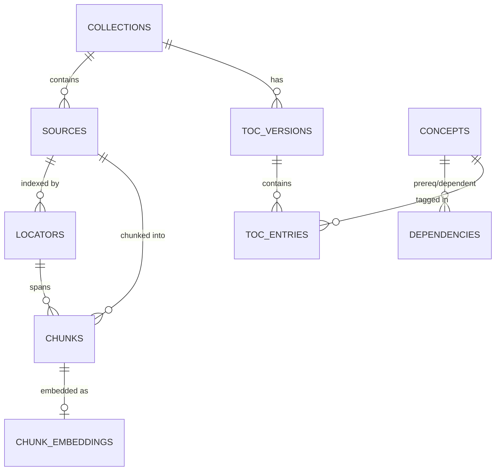
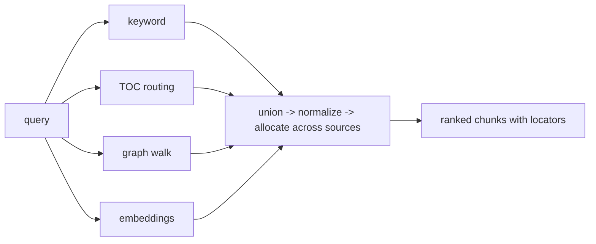
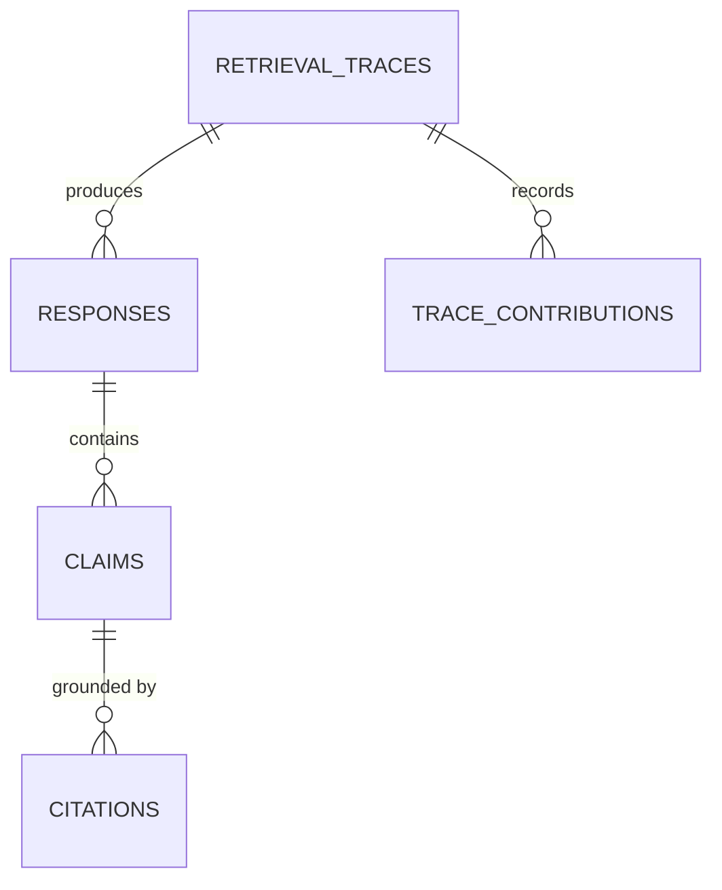

# Architecture: Emory STEM Advisor

Design doc for the retrieval system. The primary goal is accuracy: every
answer must be grounded in the internal docs, and the system must be able to
show why each claim is believed. Retrieval uses three layers (TOC index,
knowledge graph, embeddings) behind one fusion and citation contract,
following the design we validated previously.

## Core principle

No single retrieval method is trusted alone. Each seam answers a different
question about the query. Candidates from all active seams are fused, and
every surviving chunk must carry a locator back to its source. The citation
contract is what keeps the harness accountable: a chunk that cannot be
traced to a source location never reaches the model.

Invariants. These hold in every configuration and are enforced by tests.

1. Every chunk handed to the generative model has at least one locator and
   one retrieval-trace entry naming the seam(s) that produced it.
2. Vectors of different dimensionality or from different models are never
   scored against each other.
3. Seam quotas, fusion parameters, and model routing live in versioned
   config. Nothing retrieval-critical is hardcoded.
4. A query with zero grounded candidates is a refusal, never an ungrounded
   answer.
5. Every change ships with an eval delta against the frozen eval set. A
   regression blocks merge.

## Data model

Postgres is the store. Logical entities:



### sources

The ingested document, stored whole. `file_hash` dedups re-uploads.
`status` is one of `uploaded`, `parsed`, `chunked`, `indexed`, `failed`,
with `error_message` set on failure.

### locators

The per-format table of contents of one source:
`(locator_id, source_id, locator_type, start, end, label)`.
`locator_type` is a free string (`page`, `slide`, `section`, `timestamp`,
`line_range`, `cell_range`, ...), so new formats need no schema change.
Citations render the label ("slide 7", "page 3").

### chunks

The retrieval unit. Token-bounded, not line-bounded.

```sql
CREATE TABLE chunks (
    chunk_id      uuid PRIMARY KEY,
    source_id     uuid NOT NULL REFERENCES sources,
    locator_id    uuid NOT NULL REFERENCES locators,
    chunk_index   int  NOT NULL,          -- position within source
    token_count   int  NOT NULL,
    text          text NOT NULL
);
```

Chunking rules:

- `target_tokens` and `overlap_tokens` come from config (default 512 / 64).
- Boundaries fall on structure where the format provides it (section breaks,
  page edges); otherwise on the sentence end nearest the token budget.
- A chunk spanning multiple locators records the locator it starts in. At
  citation time the span is rendered from that locator through the last
  locator the text reaches.
- Chunk text is normalized at extraction (BOM stripped, Unicode NFC, cp1252
  fallback) so re-ingesting identical bytes produces identical chunks and
  dedups downstream work.

### chunk_embeddings

One row per chunk per model.

```sql
CREATE TABLE chunk_embeddings (
    chunk_id   uuid NOT NULL REFERENCES chunks,
    model      text   NOT NULL,
    embedding  float8[] NOT NULL,         -- L2-normalized at write time
    created_at timestamptz NOT NULL DEFAULT now(),
    PRIMARY KEY (chunk_id, model)
);
CREATE INDEX ON chunk_embeddings (model);
```

Vectors are L2-normalized at write time so that dot product equals cosine
similarity at query time. See the embeddings section.

### toc_versions / toc_entries

The model-written index. Entries carry
`(entry_id, toc_id, source_id, locator_id, title, description, concepts,
position)`. `concepts` is a list of names (free strings until the graph
layer lands and canonicalizes them). One TOC version per collection is
current; versions are append-only.

### concepts / dependencies

The knowledge graph. Dependencies have
`(prereq_id NULL, dependent_id, prereq_kind, external_ref NULL,
evidence_level)`. `prereq_kind` is `in_collection` or `external`. A NULL
`prereq_id` with `external_ref` set means the prerequisite lives outside
the collection.

### retrieval_traces

The audit record. Covered in the evidence chain section.

## Retrieval layers

### 1. TOC: where a topic is taught

A model-written, versioned table of contents per collection: what each
document contains and where.

Construction. After ingest writes chunks, the TOC-writer model (small and
stable; a frozen vocabulary is what makes matching reliable) receives the
locator list with short text windows and emits entries. Output is validated
against a schema before write. A re-ingest that adds sources produces
version n+1 derived from version n: existing entries are re-asserted, not
rewritten from scratch.

Query-time matching, v1 (static):

1. Normalize the query (lowercase, strip punctuation, snowball stem).
2. Score each entry: exact title match > title token overlap > description
   token overlap. Config weights, e.g. `title_exact = 1.0`,
   `title_token = 0.6`, `description_token = 0.3`.
3. Keep entries above `toc_match_min`; emit the chunks under each kept
   entry's locator, ranked by match score.

v2 (model-routed) sends the query plus candidate entry titles through the
generative model and lets it pick entries. It costs one model call per
query and ships only if it beats static matching on the eval set by a
documented margin.

### 2. Graph: what a topic depends on

Concepts and dependencies extracted from the docs, each with an evidence
level. The seam handles the case where the query matched concept X but the
answer also needs X's prerequisites or things that build on X.

Query-time expansion, one hop:

```
matched = concepts matching the query (via TOC tags or keyword)
for c in matched:
    if direction in {upstream, both}:
        emit chunks evidenced for prereqs(c)      -- what you need first
    if direction in {downstream, both}:
        emit chunks evidenced for dependents(c)   -- what this unlocks
```

Each emitted chunk is ranked as the concept match score times
`graph_decay` (config, default 0.8), so expansion candidates never outrank
direct matches.

Dormancy. Only edges with `evidence_level = 'direct'` participate at
first. `derived` and `hypothesis` edges are stored but inert. Promotion is
a config change after manual review. A wrong edge misdirects silently, so
the seam stays off until the edges are trustworthy. A seam with no data
contributes nothing and breaks nothing.

### 3. Embeddings: where a topic is implied

The math, end to end. An embedding model maps text to a vector in R^d
(d is model-dependent, roughly 768 to 3072 dimensions). Semantic similarity
is encoded as geometry: texts about the same thing land at a small angle
apart, regardless of shared vocabulary.

Cosine similarity measures that angle and ignores magnitude:

```
cos(q, c) = (q . c) / (|q| * |c|)      range [-1, 1]
```

Magnitude mostly encodes how much was said, not what it is about, so
cosine discards it. Because stored vectors are L2-normalized, |v| = 1 and
cos(q, c) = q . c at query time: a plain dot product, computable in SQL.

Ingestion. After chunks are written, each chunk's text is embedded and
stored with the model name. Re-embedding under a new model writes new rows
keyed by the new name alongside the old ones; the query-time model filter
is what makes a swap safe without a mass rewrite. Chunks without a row for
the current model do not participate. Absence is dormancy, not error.

Query time. Embed the query once, then:

```sql
SELECT c.chunk_id, SUM(q.val * e.val) AS dot
FROM chunk_embeddings e
CROSS JOIN LATERAL unnest(e.embedding) WITH ORDINALITY AS e(val, i)
JOIN      LATERAL unnest(:query_vec)  WITH ORDINALITY AS q(val, i) USING (i)
JOIN chunks c ON c.chunk_id = e.chunk_id
WHERE e.model = :current_model
  AND cardinality(e.embedding) = cardinality(:query_vec)
  AND c.source_id = ANY(:collection_sources)
GROUP BY c.chunk_id, c.chunk_index
ORDER BY dot DESC, c.chunk_index, c.chunk_id
LIMIT :embedding_limit;
```

Two guards in this query matter:

- The cardinality equality check excludes vectors whose dimension does not
  match the query's. A mismatched row is dropped, never truncated into a
  garbage score.
- The ordering (dot DESC, chunk_index, chunk_id) is fully deterministic.
  Eval reproducibility depends on it.

Quota. `embedding_only_quota` (config) bounds how many chunks found only by
embeddings survive when at least one grounded seam (keyword, TOC, graph)
also matched. Semantic expansion must not displace grounded hits. When no
grounded seam matched anything, the quota does not apply: embeddings are
the only evidence available, and invariant 4 still holds because these
chunks carry locators and a trace like any other.

Kill switch. If the funnel without embeddings matches or beats the funnel
with them on recall@k, the seam is turned off in config. No code deletion.

### Baseline seam: keyword

Full-text OR-match over chunk text (tsvector or equivalent). Catches exact
phrasing and scattered mentions with zero model dependency. Ships day one
and is the baseline every other seam must beat. Its score (ts_rank or token
coverage) normalizes through the same fusion pipeline as everything else.

## Fusion



### Step 1: candidate union

Each active seam emits `(chunk_id, rank, score, seam)` tuples. A chunk
found by multiple seams keeps every provenance record. Multiplicity is
signal (stored in the trace, visible in allocation) but does not multiply
its score.

### Step 2: seam-local normalization

Raw units are incomparable (dots, match scores, ranks), so each seam's list
normalizes independently to [0, 1]:

```
normalized(i) = 1 - (rank_i - 1) / max(1, count - 1)   -- rank seams
normalized    = (dot - min) / (max - min)              -- score seams
```

Rank seams flip to "higher is better" here, matching embeddings, so all
seams compete in one currency. Min-max on embedding dots is computed per
query over that query's candidate set.

### Step 3: relevance allocation across sources

Naive top-k can cite four chunks from one document while ignoring a more
authoritative source entirely. Allocation budgets the final cited set
(size `cited_set_size`, config) across sources instead:

1. For each source, take its best-scoring candidate as its relevance
   weight.
2. Split `cited_set_size` proportionally to the weights, rounding to
   integers by largest remainder.
3. Enforce a one-slot floor: every source with any candidate gets at least
   one slot. If the floors exceed the budget, grant them in relevance order
   until the budget is spent.
4. Availability clamp: a source's slots reduce to its actual candidate
   count. Freed slots redistribute by remainder, then to the best remaining
   candidates globally.
5. Within each source's budget, take its top candidates by fused score.

The result is diverse sourcing proportional to relevance, deterministic,
and explainable: source A earned 3 of 8 slots as best match, source B
earned 1 as a floor.

### Step 4: contract check

Every emitted chunk must have a locator and at least one seam provenance.
A violation here is a pipeline bug, not a data condition. It aborts the
query and is logged.

Seams activate as their data arrives: keyword from day one, TOC after
first ingest, graph when extracted edges pass review, embeddings when the
provider pick lands.

## Harness

### Provider seam

Every model call (answer, TOC writing, graph extraction, embeddings) goes
through one function: `(task, prompt) -> text`, with task one of `answer`,
`toc_update`, `knowledge_extraction`, `embed`. Provider, model name, base
URL, and key are config. Swapping OpenAI for an open-weight or local
provider never touches retrieval or answer code, and no SDK objects leak
past the module. Outputs at structured stages (TOC, extraction) are
validated against Pydantic schemas at the seam boundary. Malformed output
fails the stage closed; it is never half-parsed.

### Evidence chain



- `retrieval_traces`: `(trace_id, query, collection_id, created_at)`.
- `trace_contributions`: `(trace_id, chunk_id, seam, normalized_score,
  source_slot)`. The record of why each chunk was retrieved.
- `responses`: the answer, linked to its trace and model.
- `claims` / `citations`: the answer decomposed into checkable claims,
  each linked to the chunk(s) grounding it. `target_type` is a free string
  (`chunk`, `toc_entry`, `concept`, ...).

An auditor replays `trace_contributions` to see exactly which seam surfaced
each cited chunk and how it was scored. This is what makes "why did it say
that" answerable after the fact.

### Config

`configs/retrieval.toml` (versioned, illustrative):

```toml
[chunking]
target_tokens = 512
overlap_tokens = 64

[seams.keyword]
enabled = true

[seams.toc]
enabled = true
title_exact = 1.0
title_token = 0.6
description_token = 0.3
match_min = 0.3

[seams.graph]
enabled = false
decay = 0.8
directions = ["upstream"]

[seams.embed]
enabled = false
limit = 40
only_quota = 8

[fusion]
cited_set_size = 8
```

`seams.graph.enabled` flips to true when edges pass review; `seams.embed`
when the provider lands. The kill switch is `enabled = false`, and the
config diff is the decision record.

### Refusal rule

A grounded question with zero surviving candidates returns a refusal ("no
relevant material found"). The generative model is never prompted without a
context block.

## Measurement

The eval set is the contract.

Eval set. 30 to 50 real questions in user voice, each with manually
verified supporting passages, frozen under version control in
`data/eval/`. Adding questions is fine; editing existing ones invalidates
prior deltas and requires re-baselining.

Metrics:

```
recall@k           = |relevant retrieved AND top-k| / |relevant retrieved|
citation precision = claims with a verified-correct citation / claims with citations
```

Both are measured per seam and fused. Source preference is scored manually:
did the cited set prefer the authoritative document when it should have?

Decision rules:

- Fusion must beat the best single seam, or be simplified.
- Each seam must beat the funnel without it, or be turned off.
- Every change lands with an eval delta against the previous config on the
  frozen set. A regression blocks merge.

## Learning loop

The system should answer more from the corpus and less from external help
over time. The mechanism is gap capture: unanswered questions become work
items, and resolved work items enter the corpus through the normal
ingestion pipeline. The system learns by accumulating sources, never by
caching answers.

Why not cache answers directly: a stored answer has no locator and no
evidence trail. It violates invariant 1, and if the original answer was
wrong it becomes permanent contamination that future answers treat as
knowledge. Learning must keep the citation contract intact.

The loop:

1. **Gap detection.** A query yields a refusal, low fused scores, or a
   low-confidence answer. The retrieval trace records the gap (a `gaps`
   row keyed on normalized query, with embedding and partial matches).
2. **Gap capture.** Unanswered questions accumulate in a deduplicated work
   queue, oldest first.
3. **Resolution**, one of three paths:
   - Human: a curator answers or points at the covering document.
   - External: web/LLM generates a candidate, stored marked `unverified`
     and never citable.
   - Corpus growth: the actual document is uploaded.
4. **Promotion.** Verified material enters through the standard pipeline:
   a new source with locators and chunks, or a graph node with an evidence
   level. Externally derived knowledge enters as `hypothesis` and is
   promoted to `direct` on review, reusing the graph trust ladder. From
   this point the same question is answerable with full grounding and
   citations, and external help is no longer needed for it.

Metric: gap recurrence rate — the fraction of repeated questions that were
previously gaps and are now answerable from the corpus. This is the
learning KPI and is computable from the trace tables.

## Build order

1. Keyword baseline, locators, token-bounded chunks, citation contract.
2. TOC layer (small stable model writes the index; static matching).
3. Fusion of keyword and TOC: normalization, allocation, eval.
4. Graph extraction (concepts, dependencies, evidence levels), then the
   graph seam (dormant until review enables it).
5. Embeddings seam, gated on provider pick and measured help.
6. Gap capture and the learning loop.
7. Upgrades (model-routed TOC, reranker) only on documented baseline
   failure.
