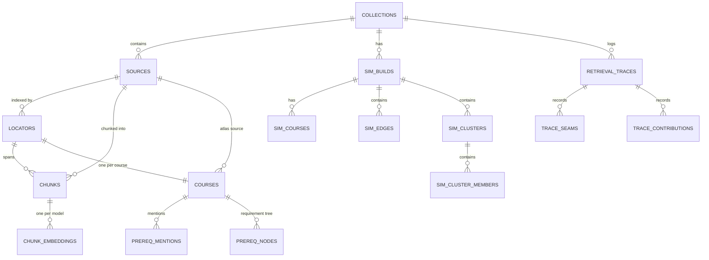
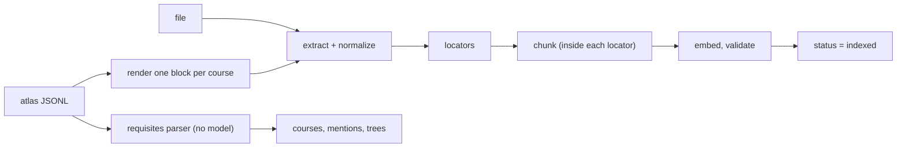
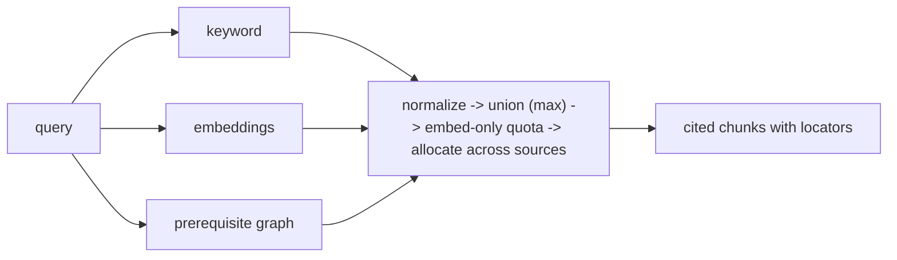
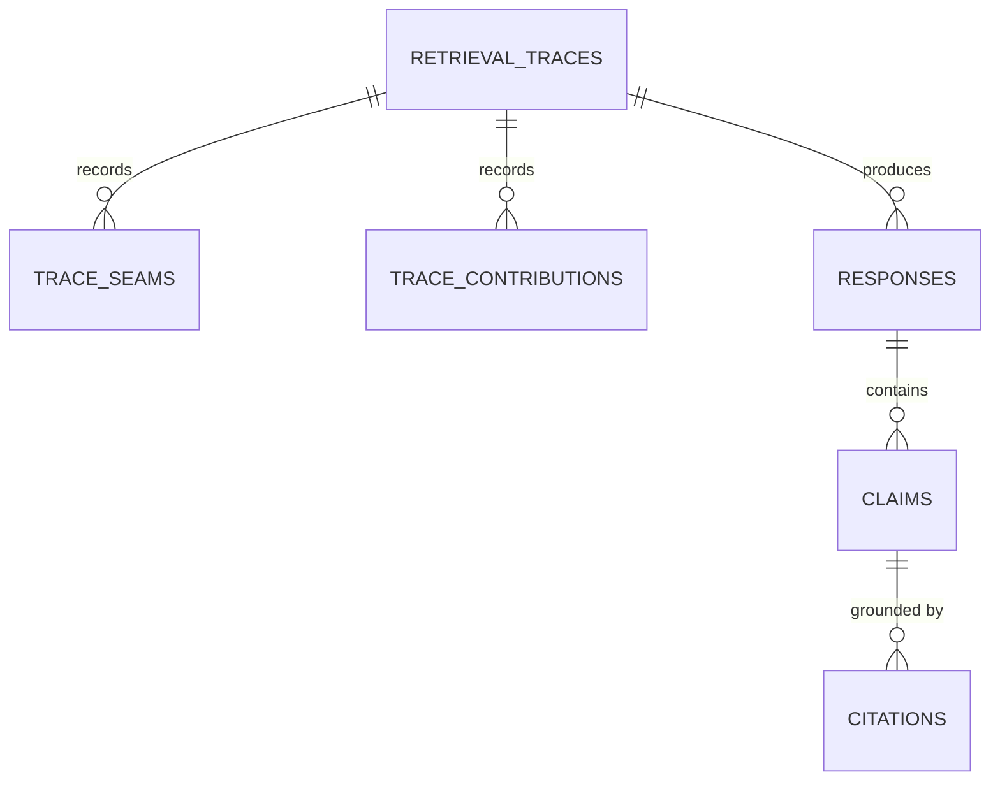

# Architecture: Emory STEM Advisor

This is the single design doc for the project. It is the contract: code and
the frontend API types must match it. It folds in what used to be three files
(`architecture.md`, the data-layer build plan, and the Stacks reference); where
those conflicted, this document reflects the system as actually built.

The primary goal is accuracy: every answer must be grounded in the internal
docs, and the system must be able to show why each claim is believed.

The data layer has four parts:

| Layer | Job | Built from |
| --- | --- | --- |
| Keyword | Find chunks that use the query's words | Postgres full-text search |
| Embeddings | Find chunks that mean the same thing in other words | Embedding model, pgvector |
| Prerequisite graph | What a course requires and what it unlocks | Parsed **deterministically** from Emory's course atlas. **An LLM never writes it** |
| Similarity graph | Course recommendations and visuals | Clustering of course embeddings, plus hand-written nudges |

The first three are retrieval seams that feed one fusion and citation
contract. The similarity graph is separate: it answers "what courses are like
this", not "which chunks answer this". There is no TOC layer.

## Provenance: this grew out of Stacks

Stacks is an earlier project by the same author (a local-first, single-user
study tool; separate private repository). Much of this design grew out of it.
**Stacks is a reference, not a template.** The two projects do not map 1:1
because the layers do not behave the same.

Rules:

1. Nothing from Stacks is adopted by default. Only items listed below as
   **Keep** or **Adapt** apply. Anything unlisted is not part of this project.
2. Stacks code, schemas, configs, and names are not copied. A Stacks lesson
   enters this project by being written here (or in code that matches), not by
   porting.
3. Where a Stacks term and a term here differ, this project's meaning wins.
   See the vocabulary table.
4. Moving an item between lists is a decision. Edit this file and say why.

### Why it is not 1:1

The layers share names with Stacks but **behave differently**: each one does a
different job here. A layer's data shape follows from its behavior, so a table
that fit a Stacks layer is no evidence it fits ours. Design each layer from
what it does here, then check Stacks for lessons.

| Layer | What it did in Stacks | What it does here |
| --- | --- | --- |
| Keyword | Full-text candidate generator (FTS5, OR-match) | Full-text candidate generator (tsvector). Closest to 1:1 |
| TOC | Grounded index from the author's structure; routed queries and seeded topic families | **None. Dropped** (decided 2026-10-01) |
| Embeddings | Query candidates and the input to chunk↔chunk similarity | Query candidates under a quota; per-model rows; input to the course similarity graph |
| Similarity graph | Chunk↔chunk edges → clusters → mind maps, misplacement flags | Course-level graph: recommendations by walking to the nearest parent cluster and returning the **whole subtree** (no top-k), plus visuals |
| Dependency graph | Concepts and dependencies tagged by an LLM job | Prerequisite graph **parsed deterministically from the course atlas. An LLM never writes it** |
| Final cut | Fusion, then a cross-encoder reranker | Fusion's relevance allocation across sources |

### Vocabulary

| Term here | Stacks term | Same thing? |
| --- | --- | --- |
| collection | course | No. A container of sources, with no owner student and no memory. |
| source / locator / chunk | same | Yes. |
| prerequisite graph | dependency graph | No. Atlas-derived, deterministic, authoritative; never model-written. |
| similarity graph | course graph | No. Nodes are courses; its jobs are recommendations and visuals. |
| (none) | TOC | Dropped. |
| (none) | memory: user/course memory, `MemoryObject` | Not adopted. No "memory" exists here. |
| artifact | artifact | No. Here: a validated, re-renderable spec attached to an answer. Stacks: a saved, versioned, user-edited document. |

### Keep

Lessons Stacks paid for that apply unchanged.

- Generic locator model with free-string `locator_type` (and the other
  free-string `kind`/`target_type` fields).
- `UNIQUE (source_id, chunk_index)` on chunks, so a double-ingest race fails
  loudly.
- Only `status = 'indexed'` sources are citable; every seam filters on it.
- Locator offsets and chunk text built from the same joined text, so page
  citations don't drift.
- Fallback line-range locators when a file has no structure, including text
  before the first heading. Never cite preamble as the next heading.
- Text normalization: BOM, NFC, cp1252, and stripping NUL bytes (Postgres text
  rejects NUL).
- No full-extracted-text column; text lives in chunks, raw files on disk.
- Embeddings: absence is "no row", never NULL; dimension guard in SQL and at
  write.
- Trace keeps per-chunk seam attribution.
- Eval cases reference (source, exact locator label), never chunk IDs.
  "page 1" must not match "page 12". Seams and fusion compared at the same k.
- Uploaded text is fenced as untrusted data in every prompt (when generation
  is built).
- Keyword seam: tokenize to `[a-z0-9]+` before building a `tsquery`; OR
  semantics.
- Fusion normalizes every seam higher-is-better (Stacks shipped this inverted
  once).
- Similarity edges kept above a floor, never top-k, so a hub keeps every
  strong link.

### Adapt

The idea carries over; the shape changes.

- **Embeddings:** per-model rows instead of Stacks' single row per chunk, so
  models can be compared on the eval set.
- **Chunk/locator mapping:** Stacks needed a `chunk_locators` join table
  because its chunks could span locators. Here a chunk never crosses a locator
  boundary, so one `locator_id` per chunk is exact.
- **Clustering:** Stacks' agglomerative hierarchy and medoids, applied to
  courses instead of chunks; labels are deterministic (no model).
- **Ingestion jobs:** `status` + `error_message` is enough until a worker
  exists. When one does, Stacks' queue lessons apply: persistent claims (not
  held row locks), a heartbeat, dead-lettering after N claims, a savepoint
  per stage, and "mark indexed" raises if it updates nothing.
- **Access control:** Stacks' retrieval trusted the course ID it was given.
  Here, authorization on `collection_id` happens at the API boundary. Designed
  fresh.

### Drop

Not part of this project.

- The TOC: versions, entries, the TOC-writer model call, the TOC seam.
- LLM extraction of concepts or dependencies (`knowledge_extraction`), and
  evidence-level review gating for prerequisites.
- SQLite, WAL/single-writer rules, FTS5, Tauri, llama.cpp, ONNX bundling,
  PyInstaller packaging.
- The memory vocabulary and subsystems: user/course memory, `MemoryObject`,
  student model, practice suites, mastery estimates.
- Companion window, Office add-in, document capture.
- Saved/versioned/editable artifacts, autosave, drafts.
- Backups, `.course` archives, the 30-day trash and keepsakes.
- Usage ledger, token budgets, tiers, billing.
- The graded-work assistance policy (three zones).

### Deferred

Not adopted now; can come back only with a measured reason.

- **Reranker** and **OCR**: only on a documented baseline failure.

## Core principle

No single retrieval method is trusted alone. Each seam answers a different
question about the query. Candidates from all active seams are fused, and
every surviving chunk must carry a locator back to its source. The citation
contract is what keeps the harness accountable: a chunk that cannot be
traced to a source location never reaches the model.

Invariants. These hold in every configuration and are enforced by tests.

1. Every chunk handed to the generative model has a locator and a
   retrieval-trace entry naming the seam(s) that produced it.
2. Vectors of different dimensionality or from different models are never
   scored against each other.
3. Seam settings, fusion parameters, and model routing live in versioned
   config. Nothing retrieval-critical is hardcoded.
4. A query with zero grounded candidates is a refusal, never an ungrounded
   answer.
5. Every change ships with an eval delta against the frozen eval set. A
   regression blocks merge.
6. The prerequisite graph is written only by the atlas parser. No model call
   writes, edits, infers, or fills in any of its rows, including as a fallback
   when parsing fails. `tests/test_no_llm_in_prereq.py` enforces the imports.

## Decisions

- **D1 Store:** Postgres 16+ with `pgvector`, raw SQL through `psycopg` 3. No
  ORM. Every statement is a named block in `backend/app/db/queries/*.sql`.
  Schema changes are numbered, append-only migrations checked by sha256.
- **D2 Dev/test database:** the `pgserver` package (embedded Postgres with
  pgvector) when `DATABASE_URL` is unset. Production sets `DATABASE_URL`.
- **D3 Stable IDs:** content-addressed `uuid5`, so re-ingesting the same file
  gives the same IDs and saved citations keep resolving:
  `source_id = uuid5(collection_id, file_hash)`,
  `locator_id = uuid5(source_id, "loc:{ordinal}")`,
  `chunk_id = uuid5(source_id, "{chunker_version}:{chunk_index}")`,
  `course_id = uuid5(collection_id, "course:{code}")`.
- **D4 One locator per chunk:** a source's locators are disjoint, ordered, and
  cover all its text; a chunk never crosses a locator boundary, so
  `chunks.locator_id` is exact.
- **D5 Context budget:** `target_tokens = 384`, `overlap_tokens = 48`,
  `cited_set_size = 6`. Config loading rejects
  `cited_set_size * target_tokens > 0.6 * HF_MAX_CONTEXT`.
- **D6 Prerequisite storage:** every course code a requisite mentions is
  stored as a *mention*, always. The boolean requirement tree is stored only
  when the parse is unambiguous. The raw atlas text is always kept.
- **D7 Similarity graph:** nodes are courses. The hierarchy comes from
  agglomerative clustering of course embeddings, which a person can nudge
  through `configs/simgraph_nudges.toml`. Confirmed 2026-10-03.

## Assumptions and open questions

- **A1** Similarity-graph nodes are **courses** (from the atlas), not document
  chunks. Confirmed 2026-10-03.
- **A2** The parent nodes of the similarity hierarchy come from clustering
  course embeddings (agglomerative), not from atlas departments/programs or
  curated categories. Confirmed 2026-10-03.
- **A3** The atlas arrives as a JSONL file in the format described under
  "Ingest". How it is fetched from Emory's atlas is not part of the design.
  **Before the prerequisites parser is trusted, 30+ real requisite strings must
  be supplied**; until then the parser is "unverified against the real atlas".
- **O1 (open, not blocking):** should visuals also draw prerequisite edges, or
  only similarity edges?

## Data model


```mermaid
erDiagram
    COLLECTIONS ||--o{ SOURCES : contains
    SOURCES ||--o{ LOCATORS : "indexed by"
    SOURCES ||--o{ CHUNKS : "chunked into"
    LOCATORS ||--o{ CHUNKS : spans
    CHUNKS ||--o{ CHUNK_EMBEDDINGS : "one per model"
    SOURCES ||--o{ COURSES : "atlas source"
    LOCATORS ||--|| COURSES : "one per course"
    COURSES ||--o{ PREREQ_MENTIONS : mentions
    COURSES ||--o{ PREREQ_NODES : "requirement tree"
    COLLECTIONS ||--o{ SIM_BUILDS : has
    SIM_BUILDS ||--o{ SIM_COURSES : has
    SIM_BUILDS ||--o{ SIM_EDGES : contains
    SIM_BUILDS ||--o{ SIM_CLUSTERS : contains
    SIM_CLUSTERS ||--o{ SIM_CLUSTER_MEMBERS : contains
    COLLECTIONS ||--o{ RETRIEVAL_TRACES : logs
    RETRIEVAL_TRACES ||--o{ TRACE_SEAMS : records
    RETRIEVAL_TRACES ||--o{ TRACE_CONTRIBUTIONS : records
```

Migrations `001`-`007` in `backend/app/db/migrations/` are the exact schema.
They are numbered and append-only: never edit an applied file, add a new one.
In outline:

### collections / sources

A collection is a container of sources (no owner, no memory). A source is one
ingested file. `file_hash` dedups re-uploads within a collection; the raw
bytes live on disk under `DATA_DIR/raw/`, not in the database. `status` is
`uploaded`, `parsed`, `chunked`, `indexed`, or `failed` (with
`error_message`). **Only `indexed` sources are citable; every seam filters on
it.**

### locators

The per-format table of contents of one source:
`(locator_id, source_id, ordinal, locator_type, label, start_char, end_char)`.
`locator_type` is a free string (`page`, `section`, `line_range`, `course`,
...), so new formats need no schema change. Citations render the label
("page 3", "ECON 101").

### chunks

The retrieval unit, token-bounded and inside one locator (D4).

```sql
CREATE TABLE chunks (
    chunk_id      uuid PRIMARY KEY,
    source_id     uuid NOT NULL REFERENCES sources ON DELETE CASCADE,
    locator_id    uuid NOT NULL REFERENCES locators ON DELETE CASCADE,
    chunk_index   int  NOT NULL,
    start_char    int  NOT NULL,
    end_char      int  NOT NULL,
    token_count   int  NOT NULL,
    text          text NOT NULL,
    search_vector tsvector GENERATED ALWAYS AS (to_tsvector('english', text)) STORED,
    UNIQUE (source_id, chunk_index)
);
```

Text is normalized at extraction (BOM stripped, Unicode NFC, cp1252
fallback, NUL bytes removed), so re-ingesting identical bytes gives identical
chunks. Locator offsets and chunk text come from the same joined text, so
citations don't drift.

### chunk_embeddings

One row per chunk per model: `(chunk_id, model, dim, embedding vector)`, with
`CHECK (vector_dims(embedding) = dim)`. Vectors are L2-normalized and checked
(dimension, unit norm within 1e-3) before they are written. A chunk with no
row for the current model is dormant, not an error. Re-embedding under a new
model adds rows beside the old ones. No ANN index yet; exact scan is fine at
this size.

### courses / prereq_mentions / prereq_nodes

The prerequisite graph (D6). `courses` holds one row per atlas course, linked
to its locator, with `requisites_raw` and a `parse_status` of `none`,
`parsed`, `ambiguous`, or `unparsed`. `prereq_mentions` holds every code each
course mentions, by kind (`prerequisite`, `corequisite`, `recommended`);
`target_course_id` is NULL when the course is not in the atlas. `prereq_nodes`
holds the requirement tree (`all`, `any`, `course`, `condition`) only for
`parsed` courses.

### sim_builds / sim_courses / sim_edges / sim_clusters / sim_cluster_members

The similarity graph, one immutable set of rows per build; exactly one build
per collection is current. `sim_courses` stores each course's vector for that
build. `sim_edges` holds course pairs at or above the similarity floor.
`sim_clusters` is the cluster tree (parent, level, label, medoid, centroid,
size), and `sim_cluster_members` lists every course under each cluster.
`sim_builds.nudges_hash` records which nudges file the build used.

> History: migration `006` first introduced curated-category tables
> (`course_categories`, `sim_categories`, ...). Migration `007` dropped them
> once A1/A2 were confirmed and replaced them with the embedding-derived
> cluster tables above. `006` is never edited; the drop lives in `007`.

### retrieval_traces / trace_seams / trace_contributions

The audit record; see the evidence chain section.

## Ingest


```mermaid
flowchart LR
    F["file"] --> X["extract + normalize"] --> L["locators"] --> C["chunk (inside each locator)"]
    C --> E["embed, validate"] --> I["status = indexed"]
    A["atlas JSONL"] --> R["render one block per course"] --> X
    A --> P["requisites parser (no model)"] --> G["courses, mentions, trees"]
```

`ingest_file` never holds a transaction across extraction or embedding. Any
failure marks the source `failed` with the error.

### Pipeline (`app/ingest/pipeline.py`)

`ingest_file(conn, *, collection_id, path, content_type, count_tokens,
embedder, embed_model, config, on_chunk_transaction=None) -> UUID`:

1. Hash raw bytes (sha256). If `(collection_id, file_hash)` exists with
   status `indexed`, return its id (dedupe). If it exists in another status,
   re-run it from step 3 (delete its locators/chunks first).
2. Copy raw bytes to `data/raw/<collection_id>/<file_hash>`; insert the source
   as `uploaded`; commit.
3. Extract (outside any transaction). On error: status `failed` +
   `error_message`, commit, re-raise.
4. One transaction: insert locators and chunks with D3 ids; status `chunked`;
   set `chunker_version`; run the optional `on_chunk_transaction` hook (the
   atlas importer uses it to write courses/mentions/nodes in the same
   transaction).
5. Embedding: call `embed_documents` on the chunk texts **outside a
   transaction**, check every vector has the same dim and unit norm
   (tolerance 1e-3; raise otherwise), then in one transaction upsert rows
   keyed `(chunk_id, embed_model)` and set status `indexed`. Embedding failure
   -> `failed` with a message.

### Extraction (`app/ingest/extract.py`)

`extract(raw, content_type, *, lines_per_locator=40) -> Extracted(text,
locators: list[LocatorSpan])`. `LocatorSpan` is `(locator_type, label,
start_char, end_char)`.

- `text/plain`: one `line_range` locator per `text_lines_per_locator` lines,
  label `"lines 1-40"`.
- `text/markdown`: `section` locators from ATX headings (`#`..`######`),
  label = heading text. Fenced code blocks (``` and ~~~) are masked before
  scanning so `#` inside code is not a heading; offsets must not shift. Text
  before the first heading, or a file with no headings, gets `line_range`
  locators instead. Never attribute preamble to a heading.
- `application/pdf` (pypdf): page texts joined with `"\n\n"`; one `page`
  locator per non-empty page, label `"page N"` (1-based). Spans are computed
  from **the same join** that builds the text. If every page is empty, raise
  `EmptyExtraction` ("no text layer; OCR is not supported").
- `application/x-course-atlas+jsonl`: rendered by the atlas importer (below).
- Other types raise `UnsupportedContentType`.

Post-condition (asserted in code, tested): locators sorted, disjoint, and
every non-whitespace character lies inside exactly one locator.

`app/ingest/normalize.py` (`decode_text`, `normalize_text`): decode honoring a
byte-order mark (UTF-8/16/32), else `utf-8-sig`, else `cp1252`; then `\r\n`/`\r`
-> `\n`, Unicode NFC, remove NUL, other C0 controls (except `\n` and `\t`), the
C1 block, soft hyphens, and zero-width/bidi characters. Same bytes always give
the same str.

### Chunking (`app/ingest/chunker.py`)

`chunk(text, locators, *, count_tokens, target_tokens, overlap_tokens) ->
list[ChunkSpan(locator_ordinal, start_char, end_char, token_count)]`.

- Each locator span is chunked independently (D4).
- Split into sentences with `(?<=[.!?])\s+` and blank lines; pack sentences
  until adding the next would exceed `target_tokens`.
- Overlap: the next chunk starts with the trailing sentences of the previous
  one whose total is at least `overlap_tokens` (or none if a single sentence
  exceeds it).
- A single sentence over `target_tokens` is hard-split on whitespace into
  pieces of at most `target_tokens`.
- Spans are char offsets into `text`; chunk text is `text[start:end].strip()`
  (store the stripped offsets). Empty chunks are dropped.
- `count_tokens` is injected. Production passes the **embedding model's
  tokenizer** (`AutoTokenizer.from_pretrained(settings.embedding_model_id)`)
  via a helper in `ingest/pipeline.py`; tests pass `whitespace_tokens`.

### The atlas

`data/atlas/*.jsonl`, one course per line:

```json
{"code": "ECON 101", "title": "Principles of Macroeconomics",
 "description": "...", "credits": "3", "requisites": "Prerequisite: MATH 111 or 112."}
```

`app/atlas/records.py`:

- `AtlasCourse` pydantic model (`code`, `title`, `description`,
  `credits: str | None`, `requisites: str | None`), extra fields ignored.
- `normalize_code(s) -> str | None`: uppercase subject of 2-5 letters, one
  space, 3 digits plus optional letter (`"econ101"` -> `"ECON 101"`,
  `"ECON  101W"` -> `"ECON 101W"`); anything else -> `None`. Duplicate codes in
  one file raise.
- `render_courses`: for each course in **code order**,
  `"{code}: {title}\n\n{description}\n\nRequisites: {requisites}"` (omit the
  requisites line when empty), courses separated by `"\n\n"`, one `course`
  locator per course with label = code.

`app/atlas/importer.py` `import_atlas(conn, *, collection_id, path, embedder,
embed_model, count_tokens, config) -> UUID`:

1. The atlas file is a source like any other. Importing an atlas into a
   collection that already has an atlas source **deletes the old atlas source
   first** (cascade removes its courses, mentions, nodes, chunks).
2. The rendered text is chunked and embedded through the normal pipeline.
3. In the same transaction as locators/chunks: insert `courses` (`locator_id`
   = that course's locator), run `parse_requisites` on the **structured
   `requisites` field** (not the chunk text), insert mentions and tree nodes
   (`node_id = uuid5(course_id, f"{kind}:{path}")` where `path` is the node's
   position path like `"0.1"`), then resolve `target_course_id` for all
   mentions in one UPDATE.
4. Log a summary: counts per `parse_status`.

`scripts/import_atlas.py` (`python -m scripts.import_atlas --collection NAME
FILE`) also prints every `ambiguous`/`unparsed` course with its raw text so a
human can fix the parser.

## Retrieval seams

### Keyword

Full-text OR-match over chunk text (`tsvector`, `ts_rank_cd`). Query text is
tokenized to `[a-z0-9]+` before it reaches `to_tsquery`, so hostile input
can't build an expression. It has zero model dependency and is the baseline
every other seam must beat.

`app/retrieval/seams/keyword.py` `keyword_seam(conn, collection_id, query,
config) -> SeamResult`:

- Tokenize in Python: lowercase, `re.findall(r"[a-z0-9]+", ...)`, drop tokens
  shorter than `min_token_len`, dedupe in order. **Only these tokens reach
  SQL**, so `f(x) = x^2`, `a <-> b`, `!`, `:*` cannot break the query.
- OR semantics: build `"tok1 | tok2 | ..."` and pass it as a parameter to
  `to_tsquery('english', %(q)s)`.
- Score `ts_rank_cd(search_vector, query)`.
- Filter: source in collection **and `sources.status = 'indexed'`**.
- Order: `score DESC, source_id, chunk_index`; `LIMIT %(limit)s`.
- No tokens -> `state='dormant'`, reason `"no searchable terms"`.
- Disabled in config -> `state='disabled'`, no query run.

### Embeddings

An embedding model maps text to a unit vector, so cosine similarity is a dot
product. The query is embedded once, inside the seam (an embedder failure
fails only this seam):

```sql
SELECT c.chunk_id, c.source_id, c.chunk_index,
       -(e.embedding <#> %(q)s) AS dot
FROM chunk_embeddings e
JOIN chunks c  ON c.chunk_id = e.chunk_id
JOIN sources s ON s.source_id = c.source_id
WHERE e.model = %(model)s
  AND e.dim = %(dim)s
  AND s.collection_id = %(collection_id)s
  AND s.status = 'indexed'
ORDER BY dot DESC, c.source_id, c.chunk_index
LIMIT %(limit)s;
```

`dim` is `len(query_vec)`; rows of another dimension are excluded, never
truncated. `min_similarity` is a floor: chunks below it are dropped in SQL
(dot products are taken over unit vectors, so it is a cosine in [-1, 1]). No
rows for the model, or none above the floor -> `state='dormant'`. The seam
takes a vector (from `embedder.embed_query` at the caller), not an embedder.

The model and dimension filters keep vectors from different models apart; the
ordering is fully deterministic. When a grounded seam (keyword or
prerequisite) also matched, at most `seams.embed.only_quota` chunks found
*only* by embeddings survive, so semantic expansion can't crowd out grounded
hits. With no grounded match the quota does not apply.

Kill switch: if retrieval without embeddings matches or beats retrieval with
them on the eval set, set `seams.embed.enabled = false`.

### Prerequisite graph

Course codes in the query (`MATH 111`, `MATH 111 or 112`) are looked up in
`app/retrieval/seams/prereq.py`. Codes are found with a regex over
`[A-Za-z]{2,5}\s?\d{3}[A-Za-z]?`, plus subject carry-forward as in the
parser. The seam returns, per `seams.prereq.directions`:

- `self`: the course's own chunks, score 1.0;
- `upstream`: chunks of the courses it requires, score `decay` (0.8);
- `downstream`: chunks of the courses it unlocks, score `decay`.

It walks mentions, not trees, so ambiguous and unparsed courses still
contribute. Only `indexed` sources. Order `raw_score DESC, source_id,
chunk_index`. It is deterministic and authoritative: there is no
evidence-level review or dormancy, because the atlas is the source of truth.

#### The parser (`app/atlas/requisites.py`)

Pure functions over fixed rules; no model. `PARSER_VERSION = "1"`. It splits by
label (`Prerequisite:`, `Corequisite:`, `Recommended:`); collects every code,
carrying the subject forward (`MATH 111, 112, or 115`); strips grade
qualifiers; maps a fixed allowlist of conditions (`permission of instructor`,
`or equivalent`, `junior standing`, ...); then parses `and`/`or`/`,`/`/` with
parentheses. A fixed list in the module drives this (not config, not a model).

Grammar: `expr := term (op term)*`, `term := CODE | CONDITION | '(' expr ')'`,
`op := and | or | , | /` where `/` means `or`.

- All operators at one paren level the same -> that group is `AllOf` or
  `AnyOf`.
- A comma list takes the operator of its final conjunction (`"A, B, and C"` ->
  `AllOf`); a comma list with no conjunction is ambiguous.
- **Mixed `and`/`or` at the same level without parentheses -> the whole course
  gets `status="ambiguous"`** and no tree. Never pick a precedence.
- Single item -> just that item (no wrapper).
- Any `leftover` -> `status="unparsed"` (mentions kept, no tree); any ambiguous
  segment -> `ambiguous` (mentions kept, no tree); otherwise `parsed`.
- Empty / whitespace / None -> `status="none"`.

A requisite the parser gets wrong is fixed in the parser or by hand, never by
a model.

Required parser test table (`tests/test_requisites.py`), exact outputs:

| Input | Status | Tree (prerequisite) | Mentions |
| --- | --- | --- | --- |
| `None` | none | – | – |
| `"Prerequisite: ECON 101."` | parsed | `CourseRef(ECON 101)` | ECON 101 |
| `"MATH 111 or 112"` | parsed | `AnyOf(MATH 111, MATH 112)` | MATH 111, MATH 112 |
| `"ECON 101 and MATH 111"` | parsed | `AllOf(...)` | both |
| `"ECON 101, ECON 112, and MATH 111"` | parsed | `AllOf(3)` | three |
| `"ECON 101, ECON 112"` | ambiguous | – | both |
| `"ECON 101 and MATH 111 or MATH 112"` | ambiguous | – | three |
| `"ECON 101 and (MATH 111 or MATH 112)"` | parsed | `AllOf(ECON 101, AnyOf(MATH 111, MATH 112))` | three |
| `"ECON 101 with a grade of C or better"` | parsed | `CourseRef(ECON 101)` | ECON 101 |
| `"ECON 101 or permission of instructor"` | parsed | `AnyOf(ECON 101, Condition(permission of instructor))` | ECON 101 |
| `"ECON 101 or equivalent"` | parsed | `AnyOf(ECON 101, Condition(equivalent))` | ECON 101 |
| `"Prerequisite: ECON 101. Corequisite: MATH 211."` | parsed | prereq `ECON 101`; coreq `MATH 211` | one per kind |
| `"ECON 101 and a love of graphs"` | unparsed | – | ECON 101 |
| `"MATH 111/112"` | parsed | `AnyOf(MATH 111, MATH 112)` | both |

#### Enforcement test

`tests/test_no_llm_in_prereq.py`: walk every `.py` under `app/atlas/` plus
`app/retrieval/seams/prereq.py`; fail if any contains `app.llm`,
`get_provider`, `transformers`, or `sentence_transformers`.

## Fusion


```mermaid
flowchart LR
    Q["query"] --> K["keyword"]
    Q --> E["embeddings"]
    Q --> P["prerequisite graph"]
    K --> F["normalize -> union (max) -> embed-only quota -> allocate across sources"]
    E --> F
    P --> F
    F --> C["cited chunks with locators"]
```

`app/retrieval/fusion.py` `fuse(results, cited_set_size, embed_only_quota) ->
list[FusedChunk]`. Pure, no DB. `FusedChunk` carries `chunk_id, source_id,
chunk_index, seams, normalized_score, source_slot, rank`.

1. **Normalize per seam, higher is better.** Keyword and embedding scores are
   min-max normalized per query to [0, 1] (all-equal scores become 1.0). The
   prerequisite seam's scores are already fixed values in (0, 1] and are used
   as-is; min-max would turn every prerequisite into 0.
2. **Union, max not sum.** A chunk found by several seams keeps every seam in
   its provenance and the highest normalized score. Agreement is recorded,
   never added.
3. **Embed-only quota:** if a grounded seam (`keyword`, `prereq`) produced
   candidates, keep at most `embed_only_quota` chunks whose only seam is
   `embed` (the best ones). If no grounded seam matched, no quota.
4. **Allocate across sources.** Naive top-k can cite four chunks from one
   document and ignore a better source. Each source's weight is its best
   score. Every source with a candidate gets one slot (if the floors exceed
   `cited_set_size`, the best sources get them). The rest of the budget is
   split by weight with largest-remainder rounding (ties: higher weight, then
   `source_id`), capped at each source's candidate count, and freed slots go
   to the heaviest sources with room, then to the best remaining candidates
   globally. Each source fills its slots with its best chunks. `source_slot`
   is the 1-based order of the source by weight. All ties break on IDs, so
   results are deterministic.
5. Final order: `normalized_score DESC, source_id, chunk_index`; `rank` 1..n.

`retrieve()` then applies the **relevance floor** (`fusion.min_score`): fused
chunks below it are dropped. The floor is per-seam normalized, so an
unrelated keyword-only query still yields exactly one candidate at 1.0; the
floor's power is dropping the weak tail of a multi-candidate query. Because at
most one candidate can score 1.0 unless a fixed-scale seam (prereq) produced
it, a query whose *only* hit is a weak embedding match already refuses at the
embedding seam's own floor. Set `min_score = 0` to disable.

With `fusion.dedupe`, cited chunks whose text is identical collapse into one
citation (the highest-scoring instance wins); `rank` is then recomputed over
the surviving list.

### `retrieve()` (`app/retrieval/retrieve.py`)

`retrieve(conn, *, collection_id, query, embedder, embed_model, config) ->
Retrieved | Refusal`:

- Run each enabled seam; a seam that raises becomes `state='failed'` with the
  error as `reason` (the other seams still run).
- Fuse. **Contract check:** every fused chunk has a locator (join it) and at
  least one seam, and its source is `indexed`; a violation raises
  `ContractViolation` (it is a bug, not a data condition).
- Zero fused chunks -> `Refusal(reason="no relevant material found", trace)`.
  The model is never called by this module.
- `Retrieved(chunks: list[CitedChunk(chunk_id, source_name, locator_label,
  text, ...)], trace)`.

## Similarity graph

Built offline by `scripts/build_simgraph.py` after the atlas import.

**Nodes and edges.** A course's vector is the normalized mean of its chunks'
embeddings for the current model. Every pair with similarity at or above
`edge_floor` becomes an edge; there is no top-k, so a hub keeps all its strong
links. Edges are computed in blocks of `block_size`.

**Hierarchy.** Agglomerative clustering (`linkage`, default `average`) on
cosine distance, cut at each of `level_cut_distances` (decreasing, so each
level nests inside the one above). Level 0 is the root, "All courses". A
cluster with the same members as its parent is folded into it. Each cluster
stores a centroid, a medoid (the member most similar to the rest; ties go to
the lowest code), and a label: its most common subject plus the medoid's
title, e.g. `ECON · Macroeconomic Theory`. No model names anything.

**Nudges** (`configs/simgraph_nudges.toml`, hand-edited, optional):

- `together`: courses that must share a cluster at every level (guaranteed;
  their distance is set to 0 before clustering);
- `apart`: courses to push apart (best effort; their distance is set to the
  maximum, and the build warns about any pair that still shares a cluster);
- `label`: a name for the cluster at a level that contains a given course.

Unknown codes and conflicting nudges produce warnings, not failures.

**Build safety.** Clustering runs before anything is written. The writes then
happen in one transaction that ends by making the new build current, so a
failed build leaves the previous one serving.

**Recommendations** (`app/simgraph/walk.py`):

```
top      = children of the root
branches = clusters in top within walk_top_margin of the best score
           and at least walk_min_similarity
for each branch, best first:
    node = branch
    while some child has size >= walk_min_subtree
          and the best such child scores higher than node:
        node = that child
    return EVERY course under node, sorted by similarity (never truncated)
courses already returned by an earlier branch are dropped
```

Example: "macroeconomics" → economics and finance → macroeconomics → every
course in that cluster, including the niche ones a top-k would cut.

**Visuals** (`app/simgraph/view.py`): the courses under a cluster and the
similarity edges among them. Whether prerequisite edges are also drawn is
open (O1); do not add them yet.

## Harness

### Provider seam

Every model call goes through one seam, with task `answer` or `embed`.
Provider, model name, and settings are env config. Concrete providers are
imported only in their `factory.py`; no SDK objects leak past the module. The
atlas parser and the prerequisite seam import no provider at all.

### Experimentation layer

Local development and eval runs use a small open model (default
`openbmb/MiniCPM-2B-128k`, Apache-2.0) loaded via Hugging Face transformers,
behind the provider seam. Weights download on first use; the only install is
pip.

Local runs are for pipeline validation, not model quality: the question a
local run answers is "does the harness behave correctly" (chunking, fusion,
citations, refusals), which must hold regardless of model strength.

Config: `HF_MODEL_ID`, `HF_MAX_CONTEXT` (default 4096, deliberately far
below the model's 128k), `HF_MAX_NEW_TOKENS`. Generation is greedy so eval
runs are reproducible.

### Evidence chain


```mermaid
erDiagram
    RETRIEVAL_TRACES ||--o{ TRACE_SEAMS : records
    RETRIEVAL_TRACES ||--o{ TRACE_CONTRIBUTIONS : records
    RETRIEVAL_TRACES ||--o{ RESPONSES : produces
    RESPONSES ||--o{ CLAIMS : contains
    CLAIMS ||--o{ CITATIONS : "grounded by"
```

- `retrieval_traces`: query, normalized query, config version, embedding
  model, refused flag.
- `trace_seams`: every seam on every query, including disabled ones, with
  its state (`active`, `dormant`, `disabled`, `failed`), reason, and
  candidate count.
- `trace_contributions`: each cited chunk with its seams, normalized score,
  source slot, and rank. `chunk_id` has no foreign key, so a trace survives
  re-ingestion.
- `responses`, `claims`, `citations` (not built yet): the answer decomposed
  into checkable claims, each linked to the chunks grounding it.

The generation layer (above) produces the answer and its citations in
memory; the API returns them. Persisting answers to `responses`/`claims` is
still to build.

An auditor replays a trace to see which seam surfaced each cited chunk and
how it scored. Every `retrieve()` call writes exactly one trace, refusals
included.

### Config

`backend/configs/retrieval.toml` is versioned; unknown keys are errors.
`app/retrieval/config.py` loads it into frozen dataclasses and enforces the
D5 budget check (it needs `Settings.hf_max_context`).

```toml
version = 1

[chunking]
chunker_version = "1"
target_tokens = 384
overlap_tokens = 48
text_lines_per_locator = 40

[seams.keyword]
enabled = true
limit = 40
min_token_len = 2

[seams.embed]
enabled = true
limit = 40
only_quota = 4
min_similarity = 0.25

[seams.prereq]
enabled = true
decay = 0.8
directions = ["self", "upstream"]
limit = 40

[fusion]
cited_set_size = 6
min_score = 0.15
dedupe = true

[simgraph]
edge_floor = 0.6
level_cut_distances = [0.7, 0.5, 0.35]
linkage = "average"
block_size = 1024
walk_top_margin = 0.05
walk_min_similarity = 0.3
walk_min_subtree = 5
```

The similarity numbers are starting guesses, to be tuned on the real atlas.
The kill switch for any seam is `enabled = false`, and the config diff is the
decision record.

### Refusal rule

A query with zero surviving candidates returns a refusal ("no relevant
material found"), still with a trace. The generative model is never prompted
without a context block.

### Answer generation

`app/generation/answer.py` is the only place an answer prompt is built. It
takes the cited chunks from `retrieve()` (already contract-checked), fences
their text as untrusted data (never instructions), and asks the provider for
an answer with bracketed chunk-number citations. It maps the markers the
answer actually used back to `(source_name, locator_label, chunk_id)`
citations; if the model used no markers it cites every context chunk, so an
answer is never shown unsourced. An empty model return is flagged as a
warning (fail-closed at the API: the answer is still returned but visibly
ungrounded, and a future revision may refuse instead). `PROMPT_VERSION`
identifies the prompt for the evidence chain.

Nothing here imports a concrete provider: it takes a `Provider` from the API
dependency wiring.

### HTTP API

`app/api/` is a FastAPI app (`create_app`). Concrete providers are built once
there and stored on `app.state`; dependencies read them from the app, and
tests overwrite them with fakes. `scripts/serve.py` runs it
(`uvicorn app.api:app`). Endpoints:

| Method | Path | Returns |
| --- | --- | --- |
| GET | `/health` | `{"status": "ok"}` |
| GET | `/api/collections` | collections |
| GET | `/api/sources?collection=` | sources with status + chunk count |
| POST | `/api/sources` | ingest an uploaded file -> source |
| POST | `/api/query` | grounded answer or refusal (with trace) |
| GET | `/api/recommendations?query=&collection=` | similarity-graph recommendations |
| GET | `/api/subgraph/{cluster_id}` | nodes + edges for a cluster |

Request/response schemas mirror `frontend/src/api/types.ts` field-for-field.
A named collection that does not exist is a 404, never an empty result.
`DEFAULT_COLLECTION` (env) names the collection used when a request omits one.

The frontend `HttpClient` calls these paths; `VITE_API_MODE=http` selects it,
and the Vite dev server proxies `/api` and `/health` to `127.0.0.1:8000` so
there is no CORS in development. `VITE_API_BASE_URL` overrides the proxy.

The upload path approximates token counts (whitespace) rather than loading the
embedding tokenizer; the scripts use the exact tokenizer. Chunking stays
token-bounded either way. Ingestion is synchronous in the request for now; a
worker (with Stacks' queue lessons) is deferred.

### Generation layers: answer artifacts

Answers are not only prose. The harness supports typed **artifacts**:
rendered outputs attached to an answer. The model produces a structured spec,
the system validates it, and a fixed renderer turns it into something
interactive. The model never emits executable output directly.

Kinds, in trust order:

1. **markdown**: formatted documents (study guides, summaries).
2. **table / dataset**: rows + column schema, rendered as a sortable table.
3. **chart**: a declarative spec (Vega-Lite or equivalent), no code.
4. **diagram**: a node/edge spec rendered by an interactive graph component.
5. **html**: freeform, least trusted; rendered in a sandboxed iframe (no
   scripts, network, or storage), or rejected for a lower tier.

The artifact contract:

```json
{
  "kind": "diagram",
  "title": "Solution methods for linear systems",
  "nodes": [
    {"id": "n1", "label": "Normal equations", "concept_id": "..."},
    {"id": "n2", "label": "Gradient descent", "concept_id": "..."}
  ],
  "edges": [
    {"from": "n1", "to": "n2", "relation": "alternative_to",
     "evidence_level": "direct", "chunk_ids": ["..."]}
  ]
}
```

- Every artifact declares `kind`, a validated spec, and provenance
  `(trace_id, model_id, prompt_version)`, and is stored so it can be
  re-rendered and re-evaluated.
- Every content-bearing element carries its grounding (chunk ids). An element
  with no backing chunk is rejected, same as a text claim.
- Specs are validated against a schema before storage; malformed specs fail
  closed.
- One fixed frontend component renders each kind; interactions always lead
  back to chunks and locators.

Not built yet. Note: `concept_id` and `evidence_level` above (and in the
frontend's `ArtifactElementRef`) predate the removal of LLM-extracted
concepts. When this layer is built, elements ground to courses and chunks;
`evidence_level` here means how directly a chunk supports an artifact
element, never anything about the prerequisite graph.

**Processing pipelines** (later): the model plans steps, the harness executes
them against the corpus, and the result renders as a table/chart with
provenance for every input. Ships only when a measured eval failure justifies
it.

## Measurement

The eval set is the contract.

Eval set. 30 to 50 real questions in user voice, each with manually verified
supporting passages, frozen in `data/eval/retrieval.jsonl`. Each case names
expected `(source filename, exact locator label)` pairs, never chunk IDs;
"page 1" does not match "page 12". Adding questions is fine; editing existing
ones requires re-baselining.

`scripts/eval_retrieval.py` reports recall@k per seam and fused, at the same
k, and whether fusion beats the best single seam (strictly). A case whose
expected source/locator doesn't exist is reported as `unresolved` and
excluded, never counted as a pass.

Decision rules:

- Fusion must beat the best single seam, or be simplified.
- Each seam must beat the funnel without it, or be turned off.
- Every change lands with an eval delta against the previous config. A
  regression blocks merge.

## Learning loop

The system should answer more from the corpus over time. The mechanism is gap
capture: unanswered questions become work items, and resolved work items
enter the corpus through the normal ingestion pipeline. The system learns by
accumulating sources, never by caching answers (a cached answer has no
locator and would turn a wrong answer into permanent "knowledge").

1. **Gap detection.** A refusal or low fused scores records a gap.
2. **Gap capture.** Gaps accumulate in a deduplicated queue, oldest first.
3. **Resolution (human-only).** A curator answers or points at the covering
   document.
4. **Promotion.** The material enters as a normal source with locators and
   chunks. Prerequisite facts change only through the atlas.

Metric: gap recurrence rate, the fraction of repeated questions that were
gaps and are now answerable from the corpus. Not built yet.

## Build history and status

Done — data layer and retrieval (phases 0-8, 2026-10-03):

1. Database, migrations, named queries.
2. Sources, locators, chunks; keyword seam.
3. Embeddings and the embed seam.
4. Course atlas, deterministic requisites parser, prerequisite seam.
5. Fusion, trace, refusal, eval runner.
6. Similarity graph: clustering, nudges, recommendations, visuals.
7. Frontend contract sync (seams `keyword`, `embed`, `prereq`).
8. Documentation sync (this file).

Phase 6 as built differs from the original plan text: A1/A2 were confirmed
with hand nudges added, clusters live in migration `007` (006's
curated-category tables are dropped), a cluster with the same members as its
parent is folded into it, and fusion uses the prerequisite seam's fixed
scores as-is instead of min-max (which zeroed every prerequisite).

Done since: guard fixes (relevance floors, citation dedupe, body-less heading
merge, normalization hardening, `.env` loader) and the HTTP API + grounded
answer generation. Appendix A records the prior-system failures each guard
addresses.

Still to build:

1. Verify the parser against 30+ real atlas requisite strings (A3), and tune
   the similarity numbers on the real atlas.
2. Recommendation UI in the frontend (the endpoint exists).
3. Evidence chain tables (`responses`/`claims`/`citations`) and persisting
   generated answers + artifacts.
4. Artifact layer, then processing pipelines.
5. Gap capture and the learning loop.
6. Upgrades (reranker, OCR) only on a documented baseline failure.
7. Data-layer gaps from the prior system still open: numeric/punctuation
   keyword search (`Table 2.2`), and per-document/source scoping for queries
   (see Appendix A).

## Layout and commands

Backend (Python 3.12), from `backend/`:

```bash
python -m venv .venv
.venv/Scripts/python -m pip install -e "backend[dev]"
../.venv/Scripts/python -m pytest                       # all tests, incl. DB
../.venv/Scripts/python -m ruff check .
../.venv/Scripts/python -m scripts.ingest --collection NAME FILE [FILE ...]
../.venv/Scripts/python -m scripts.import_atlas --collection NAME FILE
../.venv/Scripts/python -m scripts.build_simgraph --collection NAME [--nudges FILE]
../.venv/Scripts/python -m scripts.eval_retrieval [--cases FILE]
```

`ruff` (line-length 100) is the linter; `pytest` config sets
`testpaths=["tests"]`. Frontend, from `frontend/`: `npm run dev`,
`npm run typecheck`, `npm run build`.

Constraints worth not re-learning:

- `transformers==4.38.2` is pinned exactly: MiniCPM-2B-128k ships remote code
  against the 4.38 API. `sentence-transformers==3.3.1` is pinned as the
  newest line compatible with that transform. Do not bump either without
  re-validating.
- All env config is in `backend/app/config.py`; nothing model-specific is
  hardcoded. Defaults: `LLM_PROVIDER=hf-local` (MiniCPM-2B-128k),
  `EMBEDDING_PROVIDER=granite` (`granite-embedding-125m-english`, 512-token
  ceiling), `DATABASE_URL` unset (embedded `pgserver`), `DATA_DIR=data/`.
  Embedders default to CPU and L2-normalize output.
- Generation is greedy deliberately so eval runs are reproducible. Don't add
  sampling defaults.
- IDs are content-addressed `uuid5` (D3) so re-ingest keeps citations stable.
  Don't switch them to random IDs.
- Frontend has no test runner or linter configured; `typecheck`/`build` is the
  only verification.

## Review checklist

- No LLM import, call, or model in `app/atlas/` or the prereq seam.
- No TOC table, seam, config, or prompt anywhere.
- Every seam filters `sources.status = 'indexed'`.
- No inline SQL in Python; every statement is a named block.
- Keyword seam: only `[a-z0-9]+` tokens reach SQL.
- Embeddings: model + dim filter in SQL; unit-norm check before write.
- Fusion: every seam normalized higher-is-better; max not sum.
- Relevance floors (`seams.embed.min_similarity`, `fusion.min_score`) applied
  before citation; identical cited text deduped when `fusion.dedupe`.
- Recommendations: no truncation of the chosen subtree.
- IDs follow D3; re-ingest yields the same ids.
- Zero skipped DB tests; `ruff` clean.

## Appendix A: failure modes from the prior system

The prior system (Stacks) shipped a long list of retrieval-, ingest-, and
generation-layer bugs. This appendix records the ones that could plausibly
recur here, so the design either prevents them structurally or names the
guard. It is a checklist for future phases, not a spec.

### Prevented by the current design

- **A chunk cited to the wrong page / passages spanning several pages.**
  Prevented: a chunk never crosses a locator (D4) and is hard-bounded by
  `target_tokens` (D5); `cited_chunk_details` joins the locator per chunk.
- **"Sources used" listing everything searched, or expanding empty.**
  Prevented: `Retrieved.chunks` (cited) is separate from the trace's
  `candidate_count`; the UI shows only cited chunks.
- **Chunks reaching the model with no document/author/page -> misattribution.**
  Prevented: `CitedChunk` always carries `source_name` + `locator_label`.
- **Reversed citation ranges like `[5-3]`.** N/A: we emit one locator label,
  never a range.
- **Empty or whitespace-only chunks stored and searched.** Prevented: empty
  chunks are dropped in the chunker.
- **Ingest/embedding failure hidden from the user.** Prevented:
  `set_source_failed` + `error_message`; only `indexed` sources are citable.
- **Mixing vectors from different models/dimensions.** Prevented: `model` +
  `dim` filter in SQL and a unit-norm check at write.

### Fixed (guard added, with regression tests)

- **No relevance cutoff.** Fixed: `seams.embed.min_similarity` drops
  dissimilar chunks in the embedding seam, and `fusion.min_score` drops the
  weak fused tail before citation. Note the honest limit: per-query min-max
  means the best keyword hit is always 1.0, so a keyword-only query with one
  hit still cites it; the floor bites on multi-candidate results.
- **Duplicate passages.** Fixed: `fusion.dedupe` collapses identical cited
  text (the 48-token overlap can otherwise cite the same passage twice).
  Content-level dedup at ingest is not done; the citation layer handles it.
- **Empty/header-only locators.** Fixed: the markdown extractor merges
  body-less headings into the next section that has a body (or the previous
  one for a trailing run), so a lone `##` title is never a passage by itself.
- **Soft hyphens, C1 controls, zero-width/bidi characters.** Fixed:
  `normalize_text` strips U+00AD, the C1 block, and zero-width/bidi controls.
  BOM-aware decoding added for UTF-16/UTF-32. Remaining: encoding detection is
  still only as good as the BOM; a UTF-16 file without one decodes to
  cp1252 garbage, which is at least not silently mis-tiled.
- **No `.env` loader.** Fixed: `app/config.py` loads `REPO_ROOT/.env` at
  import via `os.environ.setdefault`, so the shell always wins (by design).

### Real gaps still open

- **Numbers/punctuation unsearchable ("Table 2.2").** Tokens are `[a-z0-9]+`
  and `min_token_len = 2` drops short tokens, so `2.2` vanishes; numeric
  queries match nothing. Course codes are rescued only by the prereq seam.
  Needs a keyword strategy change, not a config tweak.
- **No document/source scoping.** Every seam queries the whole collection, so
  "ask about a specific reading" pulls from everywhere (same root as Stacks'
  "Week 3 searched as a topic").

### Constraints for the not-yet-built layers

- Provider errors (e.g. a content-filter "request rejected") must become typed
  errors, never shown as an answer.
- Retry dropped connections on error **types**, never on English message text.
- Blank/empty model output must fail closed, not be shown.
- Don't send one giant request; don't burn the whole token budget on a
  call whose result is then thrown away; record token usage.
- Stream answers (the prior system made users wait 60-90 s behind a spinner).
- The relevance cutoff above must land **before** generation.
- Untrusted uploaded text is fenced as data in every prompt (Keep list).
